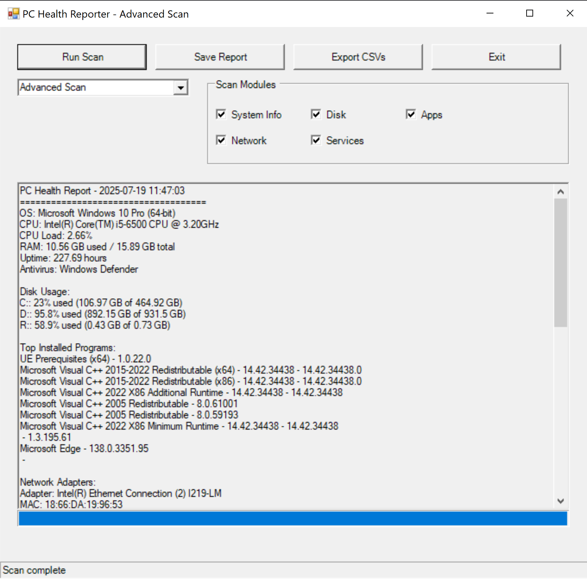

# 🖥️ PC System Health & Info Report (PowerShell)

A compact set of PowerShell scripts tailored for IT support professionals. Quickly assess system health, identify performance issues, and generate diagnostic reports — ideal for help desk tickets, remote checks, or walk-up support.

---

## 🔧 Key Features

- 🧠 **System Overview:** OS version, architecture, and uptime
- 💻 **Hardware Info:** CPU, RAM usage, and load monitoring
- 💾 **Disk Health:** Usage breakdown per drive
- 📦 **Installed Programs:** Top 10 apps by size
- 🦠 **Antivirus Status:** Ensure endpoint protection is active

---

## 🆚 Script Comparison

| Script               | Interface | Output Format          | Best Use Case               |
|----------------------|-----------|------------------------|-----------------------------|
| `PC_Report.ps1`      | CLI       | `.txt` report on Desktop | Fast remote diagnostics     |
| `PC_Report_GUI.ps1`  | GUI       | Visual + `.txt` report | In-person support sessions  |

---

## ⚙️ How to Use

1. **Download or clone** this repo.
2. Right-click `PC_Report.ps1` → **Run with PowerShell**
3. Your system health report will appear on your desktop as:

```
PC_Health_Report.txt
```

---

## 🖼️ Screenshot: PC Health Reporter GUI

Real-time scan results with a visual interface — ideal for onsite or walk-up tech support scenarios.



**GUI Highlights:**

- System Info
- Disk Usage
- Top Installed Programs
- Timestamped health scan report

---

## 📄 Sample CLI Output

Example result from `PC_Report.ps1`.  
Attach this to help desk tickets for faster triage.

```
PC Health Report - 2025-07-15 11:51:12
====================================

OS: Microsoft Windows 10 Pro (64-bit)
CPU: Intel(R) Core(TM) i5-6500 CPU @ 3.20GHz
CPU Load: 5.71%
RAM: 8.62 GB used / 15.89 GB total
Uptime: 131.76 hours
Antivirus: Windows Defender

Disk Usage:
C:: 21.7% used (101.08 GB of 464.92 GB)
D:: 95.6% used (890.21 GB of 931.5 GB)
R:: 58.9% used (0.43 GB of 0.73 GB)

Top Installed Programs (by size):
- UE Prerequisites (x64) - 1.0.22.0
- Microsoft Visual C++ 2015–2022 Redistributable (x64) - 14.42.34438
- Microsoft Visual C++ 2015–2022 Redistributable (x86) - 14.42.34438
- Microsoft Visual C++ 2022 X86 Additional Runtime - 14.42.34438
- Microsoft Visual C++ 2022 X86 Minimum Runtime - 14.42.34438
- — — 1.3.195.61
- Microsoft Edge - 138.0.3351.83
- Microsoft Edge WebView2 Runtime - 138.0.3351.83
```

---

## 🧰 Ideal For

- Tier 1–2 IT Support Technicians
- Help Desk and Walk-Up Stations
- Rapid diagnostics during live sessions
- Ticket-ready system insights

---

## 📁 Repo Structure

```
/PC-System-Health/
│
├── PC_Report.ps1           # CLI version
├── PC_Report_GUI.ps1       # GUI version
├── PCH.png                 # Screenshot for README
└── README.md               # Project documentation
```

---

## ✅ Coming Soon

- Export to CSV/HTML
- Auto-email reports
- More visual insights in GUI mode
